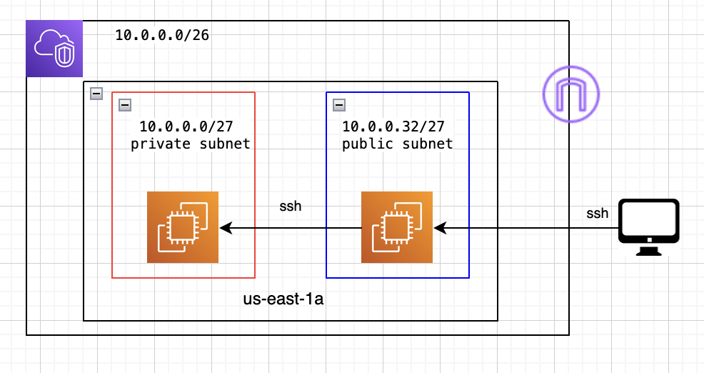

#### CDKTF-JAVA

Example of provisioning AWS infrastructure using th CDK for Terraform with Java as programming language.

#### What is deployed:

A VPC, a public and private subnet, a bastion host in the public subnet, a private box in the private subnet. 
We're using ssh to access the private box from bastion host.

This infrastructure is being deployed in 2 environments(AWS accounts, "dev" and "prod") simultaneously

#### Requirements
- 2 AWS accounts (single AWS account ok for one environment)
- An AWS user with necessary configured IAM permissions